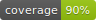

# TradeFlex



TradeFlex is a platform for building, testing, and deploying algorithmic trading strategies for stocks. It supports backtesting on historical data, paper trading with live market feeds via Alpaca, and is designed to eventually support live trading.

## Project Status

| Feature | Status | Notes |
|---------|--------|-------|
| **Backtesting** | ✅ Ready | Full pipeline: download → backtest → analyze trades |
| **Data Download** | ✅ Ready | Alpaca API (requires free API key) |
| **Paper Broker** | ✅ Ready | Realistic fees, fractional quantities, position tracking |
| **Shadow Trading** | ✅ Ready | Live Alpaca data feed with completed minute bars |
| **Alpaca Paper Trading** | ✅ Ready | Fully async API integration |
| **Alpaca Live Trading** | ⚠️ Beta | Functional, use with caution |

## Features

- ✅ **Algorithm Framework**: Extensible interface for building trading strategies
- ✅ **Historical Data Download**: Fetch real market data from Alpaca
- ✅ **Backtesting Engine**: Test strategies against historical data with realistic fees
- ✅ **Shadow Trading**: Run strategies against live market data without risking capital
- ✅ **Position Sizing**: Portfolio-based position sizing (10% of capital per trade)
- ✅ **Trading Fees**: Realistic fee simulation (0.5% default, configurable)
- ✅ **Fractional Quantities**: Support for fractional shares

## Quick Start

### Prerequisites

- .NET 9.0 SDK
- Alpaca account (free) - [Sign up here](https://alpaca.markets/)

### Installation

```bash
git clone <repository-url>
cd TradeFlex
dotnet build
```

### Configure Alpaca Credentials

Create a `.env` file in the project root:

```bash
ALPACA_API_KEY_ID="your_api_key_id"
ALPACA_SECRET_KEY="your_secret_key"
ALPACA_USE_PAPER="true"
```

Source it before running commands:

```bash
source .env
```

## Usage

### 1. Download Historical Data

Download real market data from Alpaca:

```bash
dotnet run --project TradeFlex.Cli -- download \
  --symbol AAPL \
  --from 2024-01-01 \
  --to 2024-12-31 \
  --granularity 1d \
  --output aapl_2024.parquet
```

**Granularity options**: `1m`, `5m`, `15m`, `1h`, `1d`

### 2. Run a Backtest

Test your strategy against historical data:

```bash
dotnet run --project TradeFlex.Cli -- backtest \
  --algo SMA \
  --data aapl_2024.parquet \
  --symbol AAPL
```

**Example output**:
```
[PaperBroker] Filled Buy 40.52684904 AAPL @ 246.75. Fee: 50.00. Cash: 89950.00
[PaperBroker] Filled Sell 40.52684904 AAPL @ 251.33. Fee: 50.93. Cash: 100084.52
...
Processed 12 trades
```

**Optional parameters**:
- `--from 2024-06-01`: Start date filter
- `--to 2024-12-31`: End date filter

### 3. Shadow Trading (Paper Trading)

Run your strategy against live market data without risking real money.

#### Option A: In-Memory Simulation

```bash
dotnet run --project TradeFlex.Cli -- shadow \
  --algo TradeFlex.SampleStrategies/bin/Debug/net9.0/TradeFlex.SampleStrategies.dll \
  --symbol AAPL \
  --broker paper
```

**Features:**
- ✅ Uses Alpaca live data feed
- ✅ Simulated broker with realistic fees
- ✅ No real orders submitted

#### Option B: Alpaca Paper Trading (Real Broker API) ⚠️ Beta

```bash
dotnet run --project TradeFlex.Cli -- shadow \
  --algo TradeFlex.SampleStrategies/bin/Debug/net9.0/TradeFlex.SampleStrategies.dll \
  --symbol AAPL \
  --broker alpaca
```

**Features:**
- ✅ Orders submitted to Alpaca's paper trading API
- ✅ Orders visible in [Alpaca dashboard](https://app.alpaca.markets/paper/dashboard)
- ✅ Positions synced from real broker account

**Known Limitations:**
- ⚠️ Assumes 1-second order fill time (no status polling)
- ⚠️ Fractional trading requires enabled Alpaca paper account

**Setup Guide**: See [docs/alpaca_setup.md](docs/alpaca_setup.md) for detailed configuration instructions.

Press `Ctrl+C` to stop.

## Building Your Own Strategy

### 1. Create a New Algorithm

```csharp
using TradeFlex.Abstractions;
using TradeFlex.Core;

public class MyStrategy : BaseAlgorithm
{
    public override async Task OnBarAsync(Bar bar)
    {
        // Your trading logic here
        var cash = await Broker.GetAccountBalanceAsync();
        var position = await Broker.GetPositionAsync(bar.Symbol);

        // Example: Buy if price drops below $150
        if (bar.Close < 150 && position == 0)
        {
            var quantity = (cash * 0.10m) / bar.Close;  // Use 10% of capital
            await BuyAsync(bar.Symbol, quantity);
        }

        // Example: Sell if price rises above $200
        if (bar.Close > 200 && position > 0)
        {
            await SellAsync(bar.Symbol, position);
        }
    }
}
```

### 2. Key Methods

- **`OnBarAsync(Bar bar)`**: Called for each new price bar
- **`BuyAsync(string symbol, decimal quantity)`**: Submit a market buy order
- **`SellAsync(string symbol, decimal quantity)`**: Submit a market sell order
- **`Broker.GetAccountBalanceAsync()`**: Get current cash balance
- **`Broker.GetPositionAsync(string symbol)`**: Get current position size
- **`OnRiskCheck(Order order)`**: Override to add custom risk management

### 3. Bar Data Structure

```csharp
public record Bar(
    string Symbol,      // e.g., "AAPL"
    DateTime Timestamp, // UTC timestamp
    decimal Open,       // Opening price
    decimal High,       // Highest price
    decimal Low,        // Lowest price
    decimal Close,      // Closing price
    long Volume         // Trading volume
);
```

## Built-in Algorithms

### SMA Crossover

Classic moving average crossover strategy. Buys on golden cross (fast crosses above slow), sells on death cross.

```bash
dotnet run --project TradeFlex.Cli -- backtest --algo SMA --data aapl_2024.parquet --symbol AAPL \
  --fast-period 5 \
  --slow-period 20
```

### RSI Mean Reversion

Buys when RSI indicates oversold conditions, sells when overbought.

```bash
dotnet run --project TradeFlex.Cli -- backtest --algo RSI --data aapl_2024.parquet --symbol AAPL \
  --rsi-period 14 \
  --oversold 30 \
  --overbought 70
```

### Martingale (Experimental)

Position averaging strategy that increases position size after losses.

```bash
dotnet run --project TradeFlex.Cli -- backtest --algo MARTINGALE --data aapl_2024.parquet --symbol AAPL \
  --base-pos 0.05 \
  --take-profit 0.02 \
  --stop-loss 0.01
```

### ML Predictor (Educational)

Machine learning algorithm using ML.NET FastTree binary classifier to predict price direction.

```bash
dotnet run --project TradeFlex.Cli -- backtest --algo ML --data aapl_2024.parquet --symbol AAPL \
  --warmup-bars 300 \
  --prediction-horizon 5 \
  --bullish-threshold 0.6 \
  --bearish-threshold 0.4
```

**Parameters:**
- `--warmup-bars`: Number of bars for training data collection (default: 300)
- `--prediction-horizon`: Bars into the future to predict (default: 5)
- `--bullish-threshold`: Probability above which to buy (default: 0.6)
- `--bearish-threshold`: Probability below which to sell (default: 0.4)

**Algorithm Flow:**
1. Bars 1-20: Feature warmup (accumulate enough bars for indicators)
2. Bars 21-300: Training data collection (compute features, record outcomes)
3. Bar 301: Train ML model on collected data
4. Bars 302+: Make predictions, trade based on confidence thresholds

**Features used:** 1/5/10-bar returns, price-to-SMA ratios, RSI, volatility, volume ratio, price range metrics.

> **Warning:** This algorithm is for educational purposes only. ML-based trading faces serious challenges including overfitting, market non-stationarity, and transaction costs eroding small edges. Past backtest performance does not predict future results.

## Architecture

```
TradeFlex/
├── TradeFlex.Abstractions/    # Core interfaces (ITradingAlgorithm, IBroker, etc.)
├── TradeFlex.Core/            # Base implementations (BaseAlgorithm, PaperBroker)
├── TradeFlex.BrokerAdapters/  # Broker integrations (Alpaca)
├── TradeFlex.Backtest/        # Backtesting engine and data loaders
├── TradeFlex.SampleStrategies/# Example trading strategies
├── TradeFlex.Cli/             # Command-line interface
└── TradeFlex.Tests/           # Unit tests
```

## Configuration

### Trading Fees

Default fee is 0.5%. Customize when creating the broker:

```csharp
var broker = new PaperBroker(
    initialCash: 100000m,
    feePercentage: 0.001m  // 0.1% fees
);
```

### Position Sizing

The sample strategy uses 10% of available cash per trade. Modify in your algorithm:

```csharp
var dollarAmount = cash * 0.20m;  // Use 20% instead
var quantity = dollarAmount / bar.Close;
Buy(bar.Symbol, quantity);
```

## Performance Metrics

Backtest results include:
- **Total Return**: Portfolio performance vs initial capital
- **Buy & Hold**: Benchmark comparison
- **Max Drawdown**: Largest peak-to-trough decline
- **Win Rate**: Percentage of profitable trades
- **Profit Factor**: Gross profit / gross loss ratio
- **Trade Log**: Individual executions with prices and fees

## Roadmap

### Completed
- [x] Algorithm interface
- [x] Backtesting engine
- [x] Historical data download via Alpaca
- [x] Paper broker with fees and fractional quantities
- [x] Alpaca paper trading integration (beta)
- [x] Stocks-only focus (removed crypto support)
- [x] Performance metrics (return, drawdown, win rate, profit factor)
- [x] Parameter optimizer for finding best configurations
- [x] ML-based trading algorithm (educational, ML.NET)

### Planned
- [ ] Order status polling and retry logic
- [ ] Multiple timeframe support
- [ ] Portfolio management (multiple symbols)

## Testing

Run the test suite:

```bash
dotnet test
```

## Contributing

This is a personal project, but suggestions and improvements are welcome!

## License

[Your License Here]

## Disclaimer

This software is for educational purposes only. Trading involves substantial risk of loss. Past performance does not guarantee future results. Use at your own risk.
